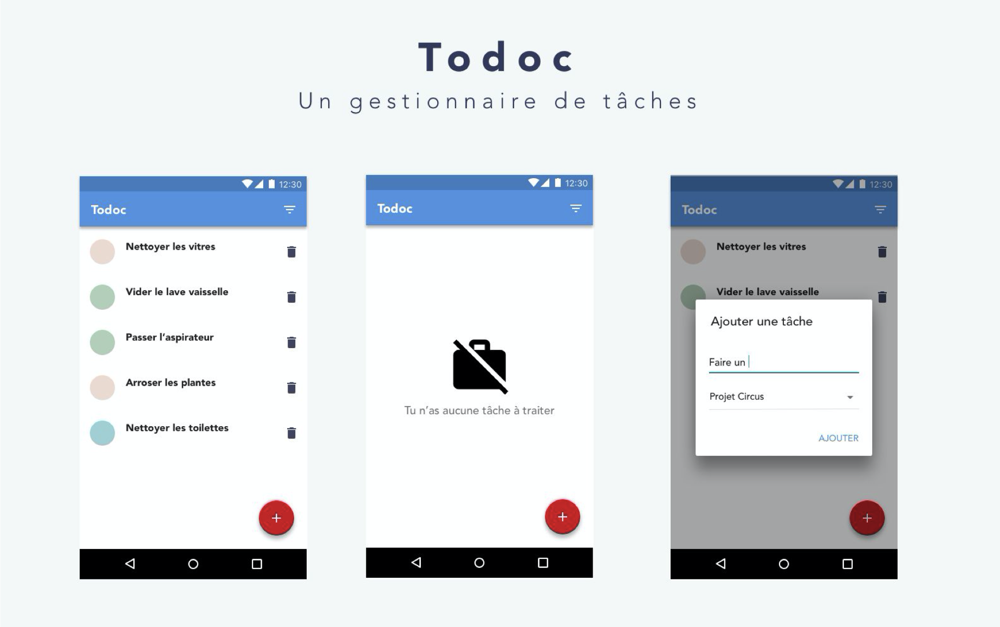

# ToDoc

ToDoc est une application destinée aux collaborateurs de CleanUp afin faciliter leur travail, plus précisement la gestion de tâches.



## Installation
Cloner ce repertoire et importer sur **Android Studio**
```bash
git clone git@github.com:Sango17/todoc-master.git
```

## Fonctionnalités

### Ajout d'une tâche
* Ajout du nom de la tâche
* Sélection du projet affilié

### Visualisation de la liste des tâches
* Extrait du détail de réunion
* Suppression de la tâche
* Filtre par ordre alphabétique
* Filtre par ordre alphabétique inversé
* Filtre par "Les plus anciens d'abord"
* Filtre par "Les plus récents d'abord"
